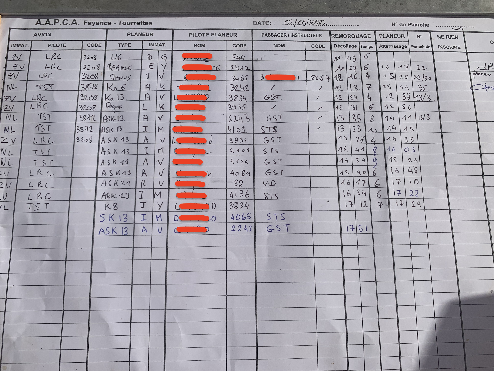
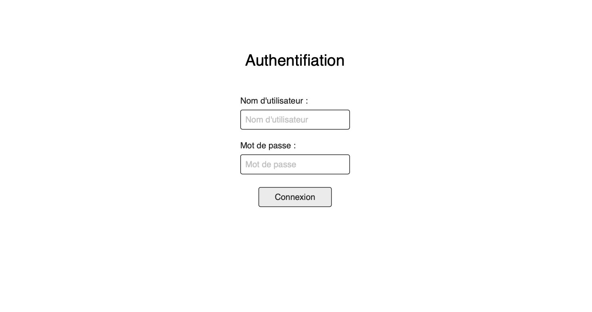

# Planche velivole (frontend)

Front-end d'un projet consistant à pratiquer le MERN stack. L'accent ne sera pas mis sur 
la gestion du projet (pas de découpage en itérations par exemple), ni sur le fait de
créer quelque chose de réelement pertinent mais bien de travailler les concepts de React,
Node + Express et MongoDB.

Le but est de créer une Single Page Application qui permet de remplacer les planches 
que l'on trouve dans les aéroclubs vélivoles, planches sur lequelles on inscrit tous les vols
d'une journée (document qui permet, ulterieurement, la facturation en fonction du temps de remorquage
et le temps passé dans la cellule du planeur).

Voici la planche en question :

## Maquettes du site

La maquette intéractive complète est <a href="https://app.moqups.com/4guPW9bWLx/view/page/a2c0110e6">consultable ici</a>.

### Page "Aujourd'hui" (page principale)

- Mode non-identifié :

- Mode identifié :

Le mode identifié permet de supprimer une ligne ou de modifier des informations (là où
la modification en mode non-identifié permet uniquement d'ajouter des informations manquantes !).

- Fonction "ajouter ligne" :

- Fonction "modifier ligne"  :

### Page "Autres Planches"

Lorsque l'on veut avoir accès aux archives, on se rend sur le deuxième onglet "Autres planches". Est alors présent un calendrier qui nous permet de selectionner une date.

- Page de la selection de la date :

- Consultation d'une ancienne planche :

### Page de connexion

